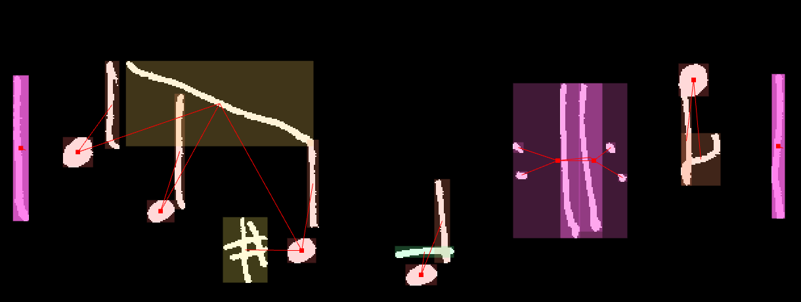

.. MUSCIMarker musical notation primitives annotation guidelines.

.. include:: shortcuts

.. _instructions:

Annotation Instructions
=======================

We learned in the :ref:`tutorial` how to control the MUSCIMarker
application and use it to annotate objects in images. Now, we will
talk about how to specifically annotate musical notation, so that
the data you are creating will be useful for optical music recognition
experiments.

.. note::

    Whereas the rest of the MUSCIMarker documentation technically applies
    to any ``MLClassList`` you might annotate, this section is specifically
    designed to cover how to properly annotate the musical notation primitives
    supplied with the annotation packages: ``mff-muscima-mlclasses-annot.xml``.

Accurate annotation is absolutely critical to the success of our research.
**Therefore, you are expected to understand these guidelines fully.**
Mistakes may happen, of course, but if they happen at a frequency
above some reasonable rate, you are going to see that reflected
in your compensation.

**If you do not understand something, please ask!**
Questions, requests for clarifications (especially accompanied
by pictures of the problematic area) and generally communicating
with us will never be discouraged. The e-mail address to direct
questions to is ``hajicj@ufal.mff.cuni.cz``

**There is an example annotation that comes up as the default image** when you
start MUSCIMarker. Many situations are already in this example. Check it out!
You can select a symbol and use the "i" keyboard shortcut to look at the annotation
at the level of individual pixels, through the Inspection popup.

(The instructions do *not* deal with how to properly receive data and submit
your work. For that, see :ref:`organizing`.)

.. note::

    *Note for researchers: these instructions have been used to annotate*
    *MUSCIMA++ 1.0.x -- For other versions of the dataset, refer to the appropriate*
    *version instructions.*

    *We assume the reader is familiar with music notation terminology.*

.. The changes will go away, to be replaced by a more coherent text.

The instructions are organized loosely around the categories of symbols:
notes themselves, notation, staff defaults (clefs, key signatures, etc.),
layout-related symbols, text, and other stuff that may come up.

Changes in 1.0.1
----------------

.. caution::

    **Flags** are labeled individually. The outermost flag is the 8th
    flag, the next one is the 16th flag, etc. See 16th notes in the example.
    (For 8th notes, nothing changes.)

Changes in 1.0
--------------

.. caution::

    The following changes have been made to the original instructions,
    based on the testing round:

    **Aside from objects, we also have Relationships.** Go re-read
    the :ref:`tutorial`, please, and read these instructions thoroughly
    for how to apply relationships correctly to music notation primitives.

    **Dots have meaning.** We now distinguish duration, staccato,
    repeat dots, and other dots.

    **Grace noteheads instead of grace notes.** Where we originally
    annotated a grace note as its primitives and then added a "grace note"
    overlay, now we just annotate the primitives -- but the notehead
    of a grace note is not a normal ``notehead-full``, there is a new
    ``grace-notehead-full`` (or ``-empty``) category.

    **Clefs are just one symbol.** Dots are no longer marked separately
    for the F-clef (or any other clef that might come with dots). Just
    mark the clef.

    **Ties and slurs are marked separately.** We had a ``curved-line``
    category for both ties and slurs, but from now on, we will mark
    slurs as ``slur`` and ties as ``tie``.

    **Key signatures and time signatures.** Just like texts consisted
    of letters and an overlapping ``text_box``, time signatures and key
    signatures now have their overlapping symbol as well. Mark the
    primitives (sharps/flats/etc. for key signatures, numerals/other
    time signature marks like *alla breve* for time signature) as usual,
    and analogous to text boxes, add the ``key_signature`` or ``time_signature``
    "supersymbol".

    **New text categories.** Dynamics, tempo, instrument names, lyrics,
    and rehearsal marks now have their own text category. Other texts
    are, well, ``other_text``. The rules for letters are still the same,
    but instead of a general ``text_box``, use the new text categories.

    **New symbols for articulation.** Turns out we missed symbols like
    *tenuto*, accents, etc. -- they have now been added to the class
    list.

    **New repeat supersymbol.** Repeats are marked as ``thin-barline``,
    ``thick-barline``, a bunch of ``repeat-dots``, and then just like
    the new key and time signatures, these primitives together should
    be marked as a ``repeat`` symbol.

    **New tuple supersymbol.** Tuples consist of a numeral primitive,
    and potentially brace/line primitives (like tuples for quarter notes).
    Their supersymbol is the ``tuple``.

    **New ossia supersymbol.** In case you see an *ossia*, annotate it
    as usual and then apply the ``ossia`` supersymbol over all of the
    primitives.

    **Nondestructive merge.** For the "supersymbols" like text, time/key
    signatures and repeats, you can select all their component primitives,
    select the appropriate symbol class, and then press **shift+m**. This
    will save you some time, as the relationships between the supersymbol
    and its component primitives will be added automatically.

Guiding principles
------------------

Thee are a few things to understand first, before we dive into
the specifics.

**Pixels matter.** Although you only see rectangles on the screen
when you annotate objects, in the background, the exact objects
are recorded: each pixel within the colored rectangle that you see
has a Belongs/Doesn't Belong label, based on how you traced the
edges of the symbol. Use the **i** keyboard shortcut to view which
pixels exactly are annotated as a part of a selected symbol.

**Background does not matter.** In black-and-white images, only
the white pixels are ever recorded as belonging to a symbol.

**All pixels in a symbol should be marked.** So if you get intersections,
such as between a stem and a beam, the intersection pixels just belong
to both symbols. Belonging to one symbol does not exclude a pixel
from belonging to another symbol. Intersections happen all the time.

.. image:: images/guidelines/intersections.png

**Not all non-background pixels are part of a symbol.** There may be
non-background pixels that are a result of the writer's mistake,
or artifacts of the input mode (e.g. stylus on a tablet - sometimes,
the tablet software might have preferred to make 90-degree corners
or straight lines where it's obvious there should be a curve...).
It's perfectly fine to leave these extra pixels out of the symbols
you are marking. In fact, including such extra pixels would be
a mistake.

.. image:: images/guidelines/spurious_pixels.png

**Layered annotation.** Sometimes (e.g. text, key signatures),
you will be asked to annotated the same thing with more markings.
For instance, a correct annotation of the  key signature for A major
has three ``sharp`` annotations and a ``key_signature`` annotation
that covers all these symbols. This is because musical notation has
several layers at which it needs to be annotated: we need to know,
at the same time, that the symbols for key signatures are sharps,
and that these praticular sharps are part of a key signature.

.. image:: images/guidelines/layered_annotation.png

**Use your judgement.** By definition, we cannot really enumerate
all the rules for annotating, as you will always encounter a new
situation with handwriting. Stick to the guiding principles, your
understanding of what the annotations should achieve (accurate markings
of the notation primitives that together form the musical score
you're presented with), and it should help you decide what the appropriate
action is for most situations. If you really are not sure, even after
thinking about it and reviewing these guidelines, then send us an email
to ``hajicj@ufal.mff.cuni.cz``!

.. note::

    **Validation**

    The MUSCIMarker tool includes functionality to check the current annotation
    against errors. Press ``v`` to select all objects that the validation
    algorithm suspects of having errors. However, validation is *not* perfect:
    it is merely a helper, not a substitute for paying attention. For instance,
    in the situation where two noteheads share a stem, validation cannot distinguish
    whether it is a mistake (and the second notehead should be attached to its
    own stem), or a chord (and the noteheads are legitimately bunched on the same
    stem). If we could distinguish things like this perfectly, we wouldn't need
    annotation...

    Passing validation, therefore, is a *neccessary*, but *not sufficient*
    condition of correctness. Sorry, you still need to really pay attention!

    There are exceptions to passing validation with no suspicious objects.
    Sometimes (rarely), there will be non-standard notation situations where
    validation will complain even with correct annotation. This is a calculated
    "cautionary" behavior: if something like that happens, you had better be
    sure about it, because *usually* situations like this are a mistake.

**We now give the instructions for individual symbol classes. Make sure**
**you understand them all.** If there is something you don't understand,
ask! (``hajicj@ufal.mff.cuni.cz``)

.. _instructions_notes:

Notes
-----

**Primitives and note symbols.** The first part of annotating notes
is marking the notation primitives: notehead, stem, flags/beams.

Then, add the note primitive relationships. Select ``notehead``-class
primitive (``notehead-full``, ``notehead-empty``, ``grace-notehead-full``,
``grace-nothead-empty``) and all other objects that are attached to the
notehead:

* stem,
* flag/beams,
* dots (duration, staccato, possibly other),
* ledger lines,
* sharps, flats, naturals,
* grace noteheads,
* tuple markings
* other notations: slurs/ties, articulations, tremolo marks, dynamics, etc.

(This is not an exhaustive list.)

.. caution:: Do not have more than one notehead selected when auto-adding
             relationships with **p**. It can very easily lead to spurious
             edges (see :ref:`tutorial_relationships` in the Tutorial).

For slurs and dynamic hairpins (cresc./decr.), attach them to *all* the noteheads
that they affect.

.. tip:: The fastest way of selecting a bunch of primitives is to use
         the **Obj. Select** tool. If you have Active Selection turned
         on in the settings, it will "pre-emptively" light up the current
         selection as you draw the lasso, making it easier to know whether
         the right symbols are being selected.

We will now walk through some examples, going from individual notes
to more complex situations.

Simple notes
^^^^^^^^^^^^

Isolated notes, one with a ``ledger_line``, one with a ``8th_flag``:

.. image:: images/guidelines/isolated_notes.png

A simple beamed group. Notice how the two noteheads share one beam,
but only the 16th note links to the second beam.
(The dot is a ``duration_dot``). :

.. image:: images/guidelines/beamed_group_simple.png

A more complex beamed group, with multiple types of notes. The 8th note
only links to the outermost ``beam``; the 16th and 32nd notes link to
the outermost and the second beam, and finally only the two 32nd notes
in the middle link to the third, innermost beam. This illustrates
the principles of only linking those primitives to a notehead that actually
affect how we read the notehead.

.. image:: images/guidelines/beamed_group_multilevel.png

Rests are simple symbols - regardless whether quarter, 8th, 16th, etc.,
or even multi-measure rests, like in the following example (note also
that it is indeed possible to tell apart whole and half rests, even
without staff lines):

.. image:: image/guidelines/rest_gallery.png

And don't forget that rests can have a ``duration_dot``:

.. image:: images/guidelines/rest_dotted.png

Chords
^^^^^^

In a chord, the noteheads do *not* interact. This implies that they share
the stem, they share beams and flags, slurs, etc., but e.g. accidentals
(flat, sharp, ...), ledger lines, ties or ornaments only have a relationship
to the notehead which they directly affect. This should not be surprising --
it's the same principle all over again.

.. image:: images/guidelines/chord_simple.png

Some chords in a beamed group:

.. image:: images/guidelines/chord_beamed.png

Chords can be tricky, especially with ledger lines. Make sure to only
attach those ledger lines to a notehead that actually affect its
pitch! Visually, this means all the notehead -- ledger line relationships
lead one way: either down (if the notes are above the staff), or up
(if the notes are below the staff). The stem is, of course, shared by
all the noteheads in the chord.

.. image:: images/guidelines/chord_with_ledger_lines.png

Grace notes
^^^^^^^^^^^

Grace note (``grace-notehead-full``) with its "main" note (``notehead-empty``).
They and their relationship is highlighted. The slur connecting the two notes
is shared between the two notes. (However, their direct relationship would still
be there, even if the slur wasn't.) Notice also the two flags on the isolated
grace note: the outer is an ``8th_flag``, the inner is a ``16th_flag``.

.. image:: images/guidelines/grace_note.png

The "strikethrough" on a grace note is attached to its stem, not the notehead
(the relationship is highlighted).
Notice also the interaction between the grace note and the following chord.

.. image:: images/guidelines/grace_strikethrough.png

If there is a clear voicing relationship between a grace note (or a grace note
chord) and a "main" note chord, the ``grace-notehead-*`` to ``notehead-*``
relationships should respect voices (highlighted; the relationships to the slur
on the bottom are omitted for clarity):

.. image:: images/guidelines/grace_chord_voices.png

Putting it all together
^^^^^^^^^^^^^^^^^^^^^^^

Let's have a look at a complex notation situation which combines all these elements:

.. image:: images/guidelines/notes_complex.png

Make sure you understand the reasons for the following:

* The short beam is only connected to the last notehead.
* The natural signs are connected to only one note.
* The arpeggio "wobble" is connected to all three notes of the chord.
* The grace note is only connected to the bottom two notes.
* The top note in the chord connects to the top stem, the bottom two notes
  to the bottom stem.
* It is not clear whether to connect the grace note to the top
  note of the chord or not. (Same for the top note and the bottom slur:
  both variants are possible.) This is a more polyphonic reading which
  considers the topmost note as a part of a separate melodic voice.
* The accent is connected to all three notes in the chord (it's a piano
  score).

.. _instructions_notations:

Other notation
--------------

In the section dedicated to notes themselves, we have also illustrated
some basic principles of how to attach objects to each other. We will
now define some more notational situations around notes:

* ties and slurs
* crescendo and decrescendo "hairpins"
* tuples
* accents and articulation
* fermatas
* trills
* tremolos
* arpeggios and glissandi
* ornaments
* segno, coda
* instrument_specific
* transposition

Fermatas
^^^^^^^^

Fermatas are attached to a ``notehead``-class object, a rest,
or a ``measure_separator``, if they are clearly related
to a barline (or a double barline..., see ``measure_separator``
guidelines below). In case a fermata is written above an empty space,
leave it unattached.

Layout
------

In this section, we will discuss objects that are related to the
overall layout and structure of the music:

* barlines
* repeat, repeat dots
* measure separator
* staff grouping symbols
* system separator
* volta

Barlines
^^^^^^^^

There are three kinds of barlines: thin, thick, and dotted.
(The ``dotted_barline`` class applies to any non-contiguous barline.)
Note that barlines are "low-level" objects, notation primitives:
one barline does not automatically equal a measure boundary (e.g.:
double barlines, barlines in repeats, barlines denoting the grouping
of staffs into systems). For example, this double barline is annotated
as two ``thin_barline`` symbols:

.. image:: images/guidelines/barlines_thin_double.png

The difference between a ``thin_barline`` and ``thick_barline`` is
basically just intent: if you think the writer just drew one line,
mark it as a ``thin_barline``; if you think the writer made an attempt
to make a barline thick, use ``thick_barline``. Here, we have a print-like
combination of barlines in a repeat:

.. image:: images/guidelines/barlines_repeat_thin_thick.png

Sometimes, what would be *typeset* as a thick barline will be written out
as a ``thin_barline``:

.. image:: images/guidelines/barlines_repeat_thin_thin.png

In multi-staff music, don't group per-staff or staff-group barlines
together under one! This is handled by the ``measure_separator``
object (see below). These are two separate ``thin_barline`` objects:

.. image:: images/guidelines/barlines_simultaneous.png

Repeats, repeat dots
^^^^^^^^^^^^^^^^^^^^

The ``repeat`` symbol is a high-level symbol that consists of barline
and ``repeat-dot`` primitives:

.. image:: images/guidelines/repeat.png

Back-to-back repeats share barlines:

.. image:: images/guidelines/repeat_back-to-back.png

Repeats that span multiple staves form a single ``repeat`` object
(with many ``repeat_dot`` "subordinate" primitives):

.. image:: images/guidelines/repeat_multistaff.png

Measure separators
^^^^^^^^^^^^^^^^^^

Barlines are not the end of dividing a piece into measures. There are
double barlines, repeats, or back-to-back repeats, all of which break
the assumption that 1 barline == separation between two bars.

In order for our data to correctly indicate both barlines and separation
into measures, we use the ``measure_separator`` overlay symbol. The rules
are simple: any number of barlines that delimit one measure from another
is grouped under one ``measure_separator``, be it a single barline,
double, or barlines inside repeats.

For example, a single barline is also a measure separator (the relationship
from the top-level ``measure_separator`` object to the ``thin_barline``
primitive is highlighted):

.. image:: images/guidelines/measure_separator_simple.png

A double barline is just one measure separator:

.. image:: images/guidelines/measure_separator_double.png

In a repeat, the barlines together form one ``measure_separator``.
When the repeat is back-to-back, sharing the barlines, there is
logically still just one ``measure_separator`` -- it indicates just
the boundary of just two measures, nothing else. In other words,
just like there is no interaction between notes in a chord, there is
no interaction between repeats and measure separators. In the following
example, the ``measure_separator`` object is highlighted:

.. image:: images/guidelines/measure_separator_repeats.png

It's hard to see, but it only has relationships to the two barlines.
The ``repeat`` symbols, on the other hand, also have relationships
to the ``repeat_dot`` primitives.

In multi-staff pieces, the measure separator should span the whole system,
again following the principle of one ``measure_separator`` symbol per measure
boundary. The barline might be a long one or many short ones, it doesn't matter:

.. image:: images/guidelines/measure_separator_multistaff.png

.. warning::

    Not every repeat hides a measure_separator inside! For instance,
    here, the repeat comes before an *Auftakt*, a pickup 8th. If you
    annotated a ``measure_separator`` here, the measure count would
    be wrong!

Staff grouping symbols
^^^^^^^^^^^^^^^^^^^^^^

There are notation primitives that indicate which staves are part
of the same system, and which staves are a group within a system
(e.g., right and left hand staves for a piano part). These are:

* ``multi-staff_bracket`` (the "horned" one)
* ``multi-staff_brace`` (the "curly" one, rarely spanning more than 2 staves)
* ``thin_barline`` (a simple line)

You will practically always find these symbols at the beginnings of systems.

In this example, there are two brackets, one which spans all staves and one
for the bottom four, and one brace:

.. image:: images/guidelines/staff_grouping_primitives.png

Then, the ``staff_grouping`` higher-level symbol indicates how these
primitives work together to actually perform staff grouping. This symbol
can be a parent of another ``staff_grouping``, to indicate sub-groups.
The subgroup only contains the primitive that delimits the given subgroup
(usually the curly ``multi-staff_brace``). The following example illustrates
three relationships:

* the top-level ``staff_grouping`` to the ``multi-staff_bracket`` which
  indicates that the large ``multi-staff_bracket`` defines a grouping
  (short red line on the bottom),
* the bottom-level ``staff_grouping`` to its own ``multi-staff_bracket``,
  which indicates that the smaller ``multi-staff_bracket`` also indicates
  a staff grouping (short red line near the top),
* the top-level ``staff_grouping`` to the bottom-level ``staff_grouping``,
  which indicates that the second staff group is a subgroup of the first one.

.. image:: images/guidelines/staff_grouping_recursive.png

.. caution::

    This is one of the situations where you will have to use the "a" keyboard
    shortcut to attach symbols to each other. If you used "p" to create
    relationships automatically, you would get an extra relationship from the
    sub-group ``staff_grouping`` to the top-level ``staff_grouping``, as well
    as the "downward"-pointing arrow in the staff groups hierarchy.

Volta
^^^^^

The *volta* is a relatively complex construction. Like the key signature or time
signature, it is a top-level symbol that consists of some others. The components
of a *volta* are, canonically, a ``horizontal_spanner`` and an ``other_numeric_sign``.
The numeric sign consists of a ``numeral_X`` (1, 2, 3, etc.), possibly an ``other-dot``
after the numbers, or ``letter_other`` for commas, parentheses, etc.

These are the components of a ``volta`` (spanner in green):

.. image:: images/guidelines/volta_components.png

And the ``volta`` goes on top of this all, with relationships to the spanner
and the numeric sign highlighted (the spanner relationship is very short, as
the bounding box of the ``volta`` is in this case identical to the bounding
box of the ``horizontal_spanner`` component):

.. image:: images/guidelines/volta_complete.png

Part defaults
-------------

This includes:

* clefs
* key signatures
* time signatures

Text
----

A large part of notation is also expressed through letters
that combine into different kinds of text:

* letters and numerals
* dynamics
* tempo
* lyrics
* figured bass
* bar and page numbers, rehearsal marks
* other

Others
------

* unclassified

...

...

...

.. danger:: The rest of the instructions is obsolete! Ignore them! We're working
            on the new ones.

...

...

...

**Seriously! Ignore everything from now on down! We just don't want
to delete all the text, because some of it will stay relevant, but it's
work-in-progress.**

...

...

...

Then, mark the entire note using the appropriate category: ``solitary_note``,
``solitary_chord``, ``beamed_group``, ``grace_note``, ``grace_beamed_group``,
or ``other_note`` for cases that do not fall into either of these
three categories.

.. image:: images/guidelines/note_primitives_and_complex.png

**What constitutes an entire note?** (Or, a beamed group?)
In the previous paragraph, you were instructed to assign a label
to an "entire note". However, this needs further clarification.

**If you're still reading this, stop! Now! This part is obsolete!**
**Go re-read the "Changes" red box instead**

*Attached* to a note means a symbol that pertains specifically
to the given note. So, ledger lines are attached to a note. Duration
dots are attached to a note. A flat or a sharp is attached to a note
(although this is more of a technical definition, because commonly
the sharp affects the rest of the notes on that pitch within the
measure, we still consider sharps and flats attached to their respective
notes). However, ties and slurs are not attached to notes. Crescendo
and decrescendo hairpins are not. Tuple signs, volta signs, texts, clefs,
key signatures -- these symbols are *not* attached to notes.

.. image:: images/guidelines/note_attachment.png

So, we want the symbols attached to a note to be a part of the complex
``note`` symbol (whichever category applies). The logic behind this decision
is this: all the components of the complex note symbol are marked
individually. So, if we later want the complex note to *not* include some
symbols like staccato dots or ledger lines, we can "subtract" them
from the complex note. But if they are *not* a part of the complex note,
adding them is a much harder problem: we would have to decide to which
complex note they should be attached, etc.

**Beams and beamed groups.** A ``beam`` is just one line connecting the stems
to give note type information. A group of four 16th notes with beams will
consist of four ``notehead_full`` symbols, four ``stem`` symbols and two
``beam`` symbols. With a dotted note in a beamed group, the very short
beam "hook" on the shorter note of the dotted pair is also a ``beam``.

.. image:: images/guidelines/beamed_group.png

**Rests** have their own set of primitives (``quarter_rest``, ``half_rest``,
etc.). Individual rests should not be marked with complex symbols, but
rests that are inside a beamed group are marked as a part of the
``beamed_group``. (Again, the logic is, we can filter them out, and
the beamed group should consist of all the duration it spans
in the given voice.)

**Grace notes** are marked like regular notes (notehead, stem and flags
or beams), but there are two extra actions. First, if the grace note
has a strikethrough (like *acacciatura* in early music), this strikethrough
is marked with the ``grace-strikethrough`` symbol. Second, the entire
grace note (or group, in case of beamed grace note groups) is marked
with the ``grace_note`` (or ``grace_beamed_group``) symbol.

**Grace notes are also attached to their complex note!** So, a grace note
belongs to two complex notes: its ``grace`` category, and the ``solitary_note``,
``beamed_group`` or whatever it is attached to.

.. image:: images/guidelines/grace_notes.png

**Other complex notes.** Sometimes, there may be notes in non-playing
contexts, such as in tempo markings or proportional tempo transitions.
These are still annotated the same way (notehead, stem, dot, etc.), but
their complex class is ``other_solitary_note`` or ``other_beamed_group``.

**Ossia.** If there is an *ossia*, annotate it as if it were regular
notation, and then mark it all as ``ossia``.

Other Notations
---------------

**Key signatures** The sharps or flats are marked as ``sharp`` or ``flat``,
just as if the symbols are next to notes. Then, the symbols making
up the key signature should all be marked as a part of a ``key_signature``
symbol.

.. image:: images/guidelines/key_signature.png

**Time signatures** The time signatures consisting of numerals are marked
as the given numerals; then, the numeral-based time signatures should be
marked as a symbol of the ``time_signature`` class.
The "whole" time signature (a "C" symbol), the
*alla breve* (a "C" with a vertical line) and other time signature symbols
have their own distinct categories, but they should be marked
as ``time_signature`` on top of these as well.

.. image:: images/guidelines/time_signature.png

**F-clef** now gets no special marking rules.

**Ties and slurs.** Please do mark ties as ties and slurs as slurs.
(This is contrary to the original instructions we had in mind, but
nevertheless, we have determined that a more detailed annotation
is better than a less detailed one, no excuses.) If you are not sure,
make a guess.

Handling text
-------------

**Text** is marked as individual letters. Upper-case letters and lower-case
letters are not the same. Numerals (including time signatures) will have
the same fate. As with key signatures or notes, texts are composite symbols;
the letters are the "text primitives" and there are classes of texts.

**Text boxes** join letters together to make sensible wholes. For instance,
a "dolce" expressive instruction should be annotated as ``letter_d``, ``letter_o``,
``letter_l``, ``letter_c``, ``letter_e``, and then the whole region
of the letters should be marked as a ``text_box``.

**Dynamics text** is also annotated as letters, for instance a *pianissimo*
sign (*pp*) is annotated as ``letter_p`` and ``letter_p``, but instead
of ``text_box``, the marking is annotated as ``text_dynamics``.

